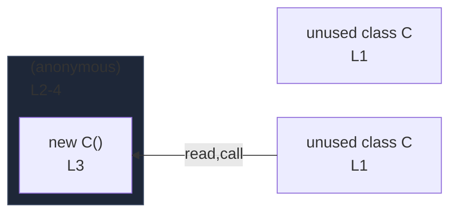

# integration/fixtures/class/declaration/recursive-only/input.ts

## Input

```ts
class C {
  m() {
    new C();
  }
}
```

## Mermaid


```mermaid
%%{init: {"flowchart": {"defaultRenderer": "elk"}}}%%
flowchart RL
  n_scope_0_C_6["unused class C<br/>L1"]
  n_scope_1_C_6["unused class C<br/>L1"]
  subgraph s_scope_2["(anonymous)<br/>L2-4"]
    direction RL
    expr_stmt_22["new C()<br/>L3"]
  end
  n_scope_1_C_6 -->|read,call| expr_stmt_22
  classDef nestL1 fill:#1e2738,stroke:#3d4a63;
  class s_scope_2 nestL1;
```
