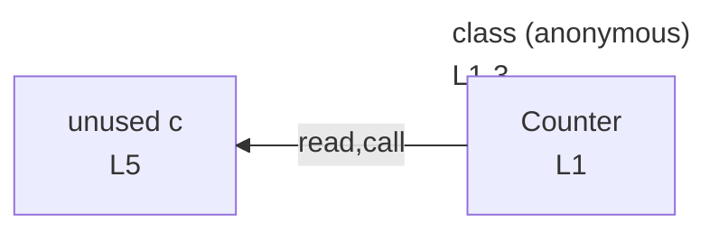

# integration/fixtures/class/expression/anonymous-basic/input.ts

## Input

```ts
const Counter = class {
  start = 0;
};

const c = new Counter();
```

## Mermaid


```mermaid
%%{init: {"flowchart": {"defaultRenderer": "elk"}}}%%
flowchart RL
  n_scope_0_Counter_6["Counter<br/>L1"]
  n_scope_0_c_47["unused c<br/>L5"]
  subgraph s_scope_1["class (anonymous)<br/>L1-3"]
    direction RL
  end
  n_scope_0_Counter_6 -->|read,call| n_scope_0_c_47
  classDef nestL1 fill:#11192a,stroke:transparent;
  class s_scope_1 nestL1;
```
