# integration/fixtures/class/expression/arrow-implicit-return-instance-field/input.ts

## Input

```ts
const makeClass = (seed: number) =>
  class {
    x = seed;
  };

const C = makeClass(0);
```

## Mermaid

```mermaid
%%{init: {"flowchart": {"defaultRenderer": "elk"}}}%%
flowchart RL
  n_scope_0_C_72["unused C<br/>L6"]
  subgraph wrap_s_scope_1[" "]
    direction TB
    n_scope_0_makeClass_6["makeClass()<br/>L1"]
    subgraph s_scope_1["makeClass()<br/>L1-4"]
      direction RL
      n_scope_1_seed_19["seed<br/>L1"]
      subgraph s_scope_2["class (anonymous)<br/>L2-4"]
        direction RL
        elk_empty_s_scope_2["No nodes"]
      end
    end
  end
  n_scope_1_seed_19 -->|read| module_root
  n_scope_0_makeClass_6 -->|read,call| n_scope_0_C_72
  module_root((module))
  classDef nestL1 fill:#11192a,stroke:transparent;
  class wrap_s_scope_1 nestL1;
  classDef nestL2 fill:#1a2538,stroke:transparent;
  class s_scope_1 nestL2;
  classDef nestL3 fill:#243047,stroke:transparent;
  class s_scope_2 nestL3;
  classDef elkEmptyPlaceholder fill:transparent,stroke:transparent;
  class elk_empty_s_scope_2 elkEmptyPlaceholder;
```


