# integration/fixtures/class/expression/decorator-on-member-in-return/input.ts

## Input

```ts
function dec(value: unknown, _ctx: unknown) {
  return value;
}

function makeClass() {
  return class {
    @dec
    m() {}
  };
}

const C = makeClass();
```

## Mermaid

```mermaid
%%{init: {"flowchart": {"defaultRenderer": "elk"}}}%%
flowchart RL
  n_scope_0_C_139["unused C<br/>L12"]
  subgraph wrap_s_scope_1[" "]
    direction TB
    n_scope_0_dec_9["dec()<br/>L1"]
    subgraph s_scope_1["dec()<br/>L1-3"]
      direction RL
      n_scope_1_value_13["value<br/>L1"]
      n_scope_1__ctx_29["unused _ctx<br/>L1"]
      subgraph s_return_scope_0_dec_9_48_61["return L2"]
        direction RL
        ret_use_ref_0["value<br/>L2"]
      end
    end
  end
  subgraph wrap_s_scope_2[" "]
    direction TB
    n_scope_0_makeClass_74["makeClass()<br/>L5"]
    subgraph s_scope_2["makeClass()<br/>L5-10"]
      direction RL
      subgraph s_scope_3["class (anonymous)<br/>L6-9"]
        direction RL
        subgraph s_scope_4["(anonymous)<br/>L8"]
          direction RL
          elk_empty_s_scope_4["No nodes"]
        end
      end
    end
  end
  n_scope_1_value_13 -->|read| ret_use_ref_0
  n_scope_0_dec_9 -->|read| module_root
  n_scope_0_makeClass_74 -->|read,call| n_scope_0_C_139
  module_root((module))
  classDef nestL1 fill:#11192a,stroke:transparent;
  class wrap_s_scope_1 nestL1;
  class wrap_s_scope_2 nestL1;
  classDef nestL2 fill:#1a2538,stroke:transparent;
  class s_scope_1 nestL2;
  class s_scope_2 nestL2;
  classDef nestL3 fill:#243047,stroke:transparent;
  class s_return_scope_0_dec_9_48_61 nestL3;
  class s_scope_3 nestL3;
  classDef nestL4 fill:#2d3b57,stroke:transparent;
  class s_scope_4 nestL4;
  classDef elkEmptyPlaceholder fill:transparent,stroke:transparent;
  class elk_empty_s_scope_4 elkEmptyPlaceholder;
```


