# integration/fixtures/class/expression/extends-clause-in-return/input.ts

## Input

```ts
function makeSubclass(Base: new () => unknown) {
  return class extends Base {};
}

const C = makeSubclass(Object);
```

## Mermaid

```mermaid
%%{init: {"flowchart": {"defaultRenderer": "elk"}}}%%
flowchart RL
  n_scope_0_C_90["unused C<br/>L5"]
  n_scope_0_Object_107["global Object"]
  subgraph wrap_s_scope_1[" "]
    direction TB
    n_scope_0_makeSubclass_9["makeSubclass()<br/>L1"]
    subgraph s_scope_1["makeSubclass()<br/>L1-3"]
      direction RL
      n_scope_1_Base_22["Base<br/>L1"]
      subgraph s_return_scope_0_makeSubclass_9_51_80["return L2"]
        direction RL
        ret_use_ref_0["Base<br/>L2"]
      end
    end
  end
  n_scope_1_Base_22 -->|read| ret_use_ref_0
  n_scope_0_makeSubclass_9 -->|read,call| n_scope_0_C_90
  n_scope_0_Object_107 -->|read| n_scope_0_C_90
  classDef nestL1 fill:#11192a,stroke:transparent;
  class wrap_s_scope_1 nestL1;
  classDef nestL2 fill:#1a2538,stroke:transparent;
  class s_scope_1 nestL2;
  classDef nestL3 fill:#243047,stroke:transparent;
  class s_return_scope_0_makeSubclass_9_51_80 nestL3;
```


