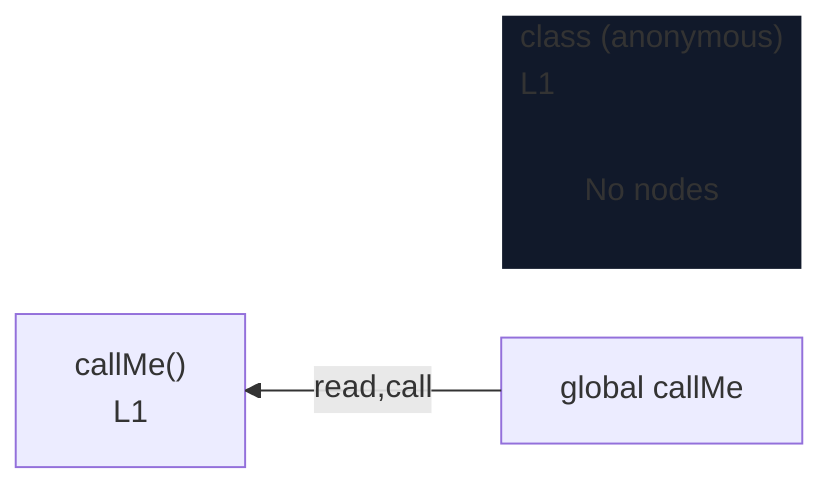

# integration/fixtures/class/expression/in-object-property-value/input.ts

## Input

```ts
callMe({ key: class {} });
```

## Mermaid


```mermaid
%%{init: {"flowchart": {"defaultRenderer": "elk"}}}%%
flowchart RL
  n_scope_0_callMe_0["global callMe"]
  subgraph s_scope_1["class (anonymous)<br/>L1"]
    direction RL
    elk_empty_s_scope_1["No nodes"]
  end
  n_scope_0_callMe_0 -->|read,call| expr_stmt_0
  expr_stmt_0["callMe()<br/>L1"]
  classDef nestL1 fill:#11192a,stroke:transparent;
  class s_scope_1 nestL1;
  classDef elkEmptyPlaceholder fill:transparent,stroke:transparent;
  class elk_empty_s_scope_1 elkEmptyPlaceholder;
```
