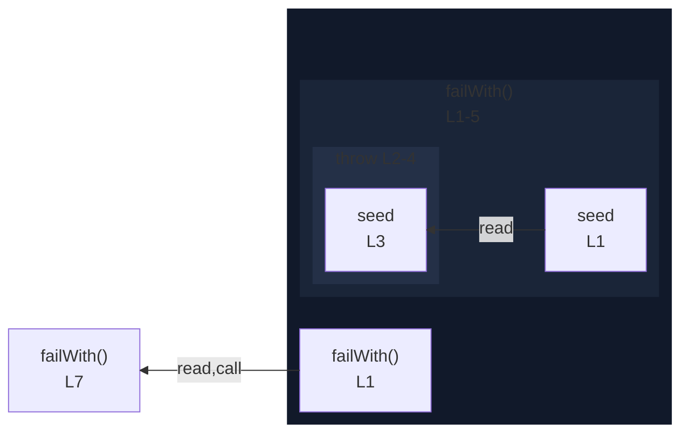

# integration/fixtures/class/expression/instance-field-in-throw/input.ts

## Input

```ts
function failWith(seed: number) {
  throw class {
    x = seed;
  };
}

failWith(0);
```

## Mermaid


```mermaid
%%{init: {"flowchart": {"defaultRenderer": "elk"}}}%%
flowchart RL
  subgraph wrap_s_scope_1[" "]
    direction TB
    n_scope_0_failWith_9["failWith()<br/>L1"]
    subgraph s_scope_1["failWith()<br/>L1-5"]
      direction RL
      n_scope_1_seed_18["seed<br/>L1"]
      subgraph s_throw_scope_0_failWith_9_36_68["throw L2-4"]
        direction RL
        throw_use_ref_0["seed<br/>L3"]
      end
    end
  end
  n_scope_1_seed_18 -->|read| throw_use_ref_0
  n_scope_0_failWith_9 -->|read,call| expr_stmt_72
  expr_stmt_72["failWith()<br/>L7"]
  classDef nestL1 fill:#11192a,stroke:transparent;
  class wrap_s_scope_1 nestL1;
  classDef nestL2 fill:#1a2538,stroke:transparent;
  class s_scope_1 nestL2;
  classDef nestL3 fill:#243047,stroke:transparent;
  class s_throw_scope_0_failWith_9_36_68 nestL3;
```
