# integration/fixtures/class/expression/method-body-in-return/input.ts

## Input

```ts
function makeFactory(seed: number) {
  return class {
    next() {
      return seed;
    }
  };
}

const C = makeFactory(0);
```

## Mermaid

```mermaid
%%{init: {"flowchart": {"defaultRenderer": "elk"}}}%%
flowchart RL
  n_scope_0_C_106["unused C<br/>L9"]
  subgraph wrap_s_scope_1[" "]
    direction TB
    n_scope_0_makeFactory_9["makeFactory()<br/>L1"]
    subgraph s_scope_1["makeFactory()<br/>L1-7"]
      direction RL
      n_scope_1_seed_21["seed<br/>L1"]
      subgraph s_scope_2["class (anonymous)<br/>L2-6"]
        direction RL
        subgraph s_scope_3["(anonymous)<br/>L3-5"]
          direction RL
          subgraph s_return_scope_0_makeFactory_9_73_85["return L4"]
            direction RL
            ret_use_ref_0["seed<br/>L4"]
          end
        end
      end
    end
  end
  n_scope_1_seed_21 -->|read| ret_use_ref_0
  n_scope_0_makeFactory_9 -->|read,call| n_scope_0_C_106
  classDef nestL1 fill:#11192a,stroke:transparent;
  class wrap_s_scope_1 nestL1;
  classDef nestL2 fill:#1a2538,stroke:transparent;
  class s_scope_1 nestL2;
  classDef nestL3 fill:#243047,stroke:transparent;
  class s_scope_2 nestL3;
  classDef nestL4 fill:#2d3b57,stroke:transparent;
  class s_scope_3 nestL4;
  classDef nestL5 fill:#364666,stroke:transparent;
  class s_return_scope_0_makeFactory_9_73_85 nestL5;
```


