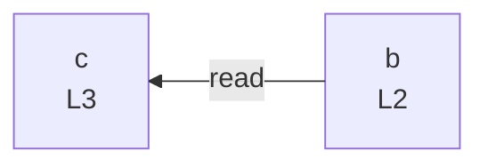

# integration/fixtures/const-chain-five/input.ts

## Input

```ts
const a = 1;
const b = a;
const c = b;
const d = c;
const e = d;
```

## Query

```sh
-r c -A 0 -B 1
```

## Mermaid


```mermaid
%%{init: {"flowchart": {"defaultRenderer": "elk"}}}%%
flowchart RL
  %% pruning: roots=[c(1)] ancestors=1 descendants=0
  n_scope_0_b_19["b<br/>L2"]
  n_scope_0_c_32["c<br/>L3"]
  n_scope_0_b_19 -->|read| n_scope_0_c_32
```
