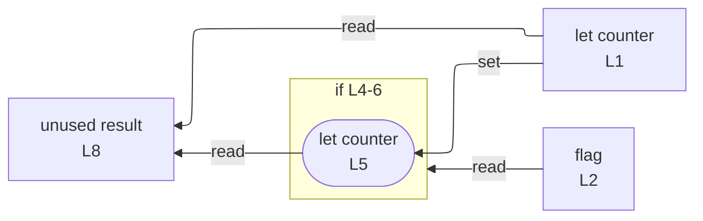

# integration/fixtures/control-if-only/input.ts

## Input

```ts
let counter = 0;
const flag = true;

if (flag) {
  counter = 1;
}

const result = counter;
```

## Mermaid


```mermaid
%%{init: {"flowchart": {"defaultRenderer": "elk"}}}%%
flowchart RL
  n_scope_0_counter_4["let counter<br/>L1"]
  n_scope_0_flag_23["flag<br/>L2"]
  n_scope_0_result_73["unused result<br/>L8"]
  subgraph s_scope_1["if L4-6"]
    direction RL
    wr_ref_1(["let counter<br/>L5"])
  end
  n_scope_0_counter_4 -->|set| wr_ref_1
  n_scope_0_flag_23 -->|read| s_scope_1
  wr_ref_1 -->|read| n_scope_0_result_73
  n_scope_0_counter_4 -->|read| n_scope_0_result_73
```
