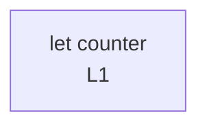

# integration/fixtures/control-if/input.ts

## Input

```ts
let counter = 0;
const flag = true;

if (flag) {
  counter = 1;
} else {
  counter = 2;
}

const result = counter;
```

## Query

```sh
-r counter -A 0 -B 2
```

## Mermaid


