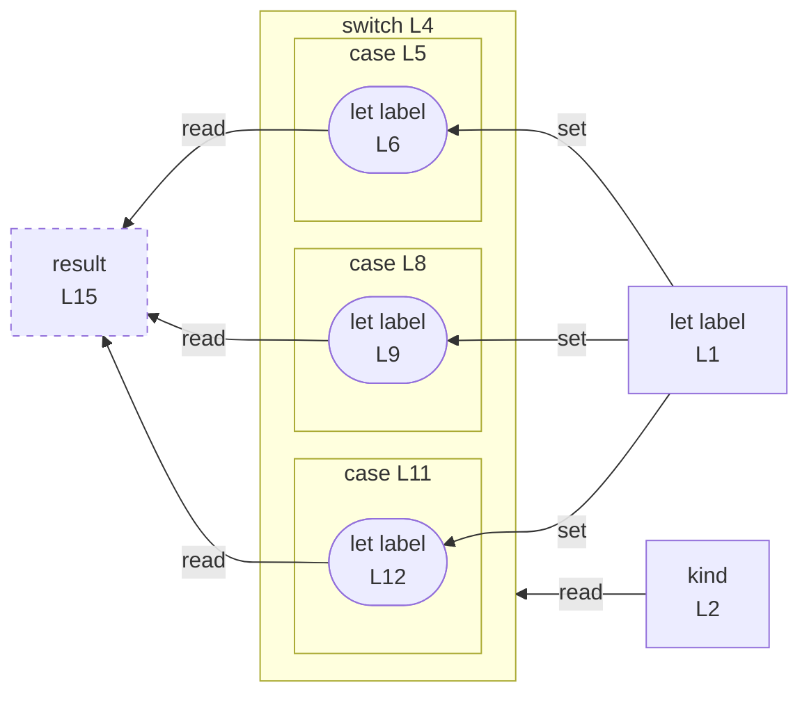

# integration/fixtures/control-switch-break/input.ts

## Input

```ts
let label = "";
const kind = "a";

switch (kind) {
  case "a":
    label = "alpha";
    break;
  case "b":
    label = "beta";
    break;
  default:
    label = "other";
}

const result = label;
```

## Mermaid


