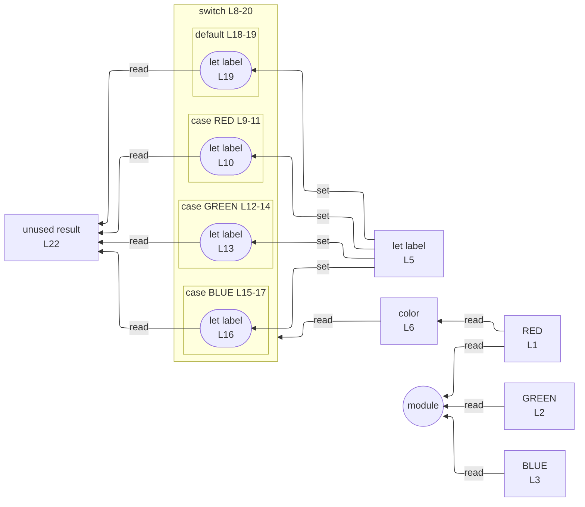

# integration/fixtures/control-switch-identifier/input.ts

## Input

```ts
const RED = "r";
const GREEN = "g";
const BLUE = "b";

let label = "";
const color = RED;

switch (color) {
  case RED:
    label = "red";
    break;
  case GREEN:
    label = "green";
    break;
  case BLUE:
    label = "blue";
    break;
  default:
    label = "unknown";
}

const result = label;
```

## Mermaid


