# integration/fixtures/control-switch-with-inner-if/input.ts

## Input

```ts
function classify(n: number, big: boolean) {
  let label;
  switch (n) {
    case 0:
      if (big) {
        label = "zero-big";
      } else {
        label = "zero-small";
      }
      break;
    case 1:
      label = "one";
      break;
    default:
      label = "other";
  }
  return label;
}

const result = classify(0, true);
```

## Mermaid

```mermaid
%%{init: {"flowchart": {"defaultRenderer": "elk"}}}%%
flowchart RL
  n_scope_0_result_307["unused result<br/>L20"]
  subgraph wrap_s_scope_1[" "]
    direction TB
    n_scope_0_classify_9["classify()<br/>L1"]
    subgraph s_scope_1["classify()<br/>L1-18"]
      direction RL
      n_scope_1_n_18["n<br/>L1"]
      n_scope_1_big_29["big<br/>L1"]
      n_scope_1_label_51["let label<br/>L2"]
      subgraph s_scope_2["switch L3-16"]
        direction RL
        subgraph s_scope_3["case 0 L4-10"]
          direction RL
          subgraph cont_if_scope_3_91["if-else L5-9"]
            direction RL
            if_test_scope_3_91{"if L5"}
            subgraph s_scope_4["if L5-7"]
              direction RL
              wr_ref_2(["let label<br/>L6"])
            end
            subgraph s_scope_5["else L7-9"]
              direction RL
              wr_ref_3(["let label<br/>L8"])
            end
          end
        end
        subgraph s_scope_6["case 1 L11-13"]
          direction RL
          wr_ref_4(["let label<br/>L12"])
        end
        subgraph s_scope_7["default L14-15"]
          direction RL
          wr_ref_5(["let label<br/>L15"])
        end
      end
      subgraph s_return_scope_0_classify_9_284_297["return L17"]
        direction RL
        ret_use_ref_6["label<br/>L17"]
      end
    end
  end
  n_scope_1_label_51 -->|set| wr_ref_2
  n_scope_1_label_51 -->|set| wr_ref_3
  n_scope_1_label_51 -->|set| wr_ref_4
  n_scope_1_label_51 -->|set| wr_ref_5
  n_scope_1_n_18 -->|read| s_scope_2
  n_scope_1_big_29 -->|read| if_test_scope_3_91
  wr_ref_2 -->|read| ret_use_ref_6
  wr_ref_3 -->|read| ret_use_ref_6
  wr_ref_4 -->|read| ret_use_ref_6
  wr_ref_5 -->|read| ret_use_ref_6
  n_scope_0_classify_9 -->|read,call| n_scope_0_result_307
  classDef fnWrap fill:#1a2030,stroke:#5a7d99;
  class wrap_s_scope_1 fnWrap;
```


