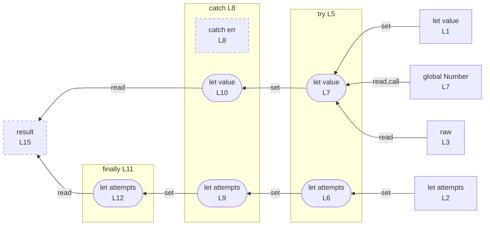

# control-try

## Input (`input.ts`)

```ts
let value = 0;
let attempts = 0;
const raw = "42";

try {
  attempts = 1;
  value = Number(raw);
} catch (err) {
  attempts = -1;
  value = -1;
} finally {
  attempts += 1;
}

const result = value + attempts;
```

## Mermaid


