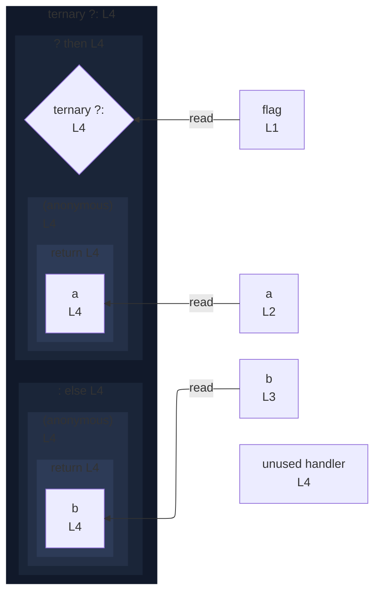

# integration/fixtures/declaration/conditional-bare-arrow-arm/input.ts

## Input

```ts
const flag = true;
const a = "a";
const b = "b";
const handler = flag ? () => a : () => b;
```

## Mermaid


```mermaid
%%{init: {"flowchart": {"defaultRenderer": "elk"}}}%%
flowchart RL
  n_scope_0_flag_6["flag<br/>L1"]
  n_scope_0_a_25["a<br/>L2"]
  n_scope_0_b_40["b<br/>L3"]
  n_scope_0_handler_55["unused handler<br/>L4"]
  subgraph cont_ternary_scope_0_65["ternary ?: L4"]
    direction RL
    subgraph s_scope_1["? then L4"]
      direction RL
      ternary_test_scope_0_65{"ternary ?:<br/>L4"}
      subgraph s_scope_2["(anonymous)<br/>L4"]
        direction RL
        subgraph s_return_scope_2_78_79["return L4"]
          direction RL
          ret_use_ref_5["a<br/>L4"]
        end
      end
    end
    subgraph s_scope_3[": else L4"]
      direction RL
      subgraph s_scope_4["(anonymous)<br/>L4"]
        direction RL
        subgraph s_return_scope_4_88_89["return L4"]
          direction RL
          ret_use_ref_6["b<br/>L4"]
        end
      end
    end
  end
  n_scope_0_flag_6 -->|read| ternary_test_scope_0_65
  n_scope_0_a_25 -->|read| ret_use_ref_5
  n_scope_0_b_40 -->|read| ret_use_ref_6
  classDef nestL1 fill:#11192a,stroke:transparent;
  class cont_ternary_scope_0_65 nestL1;
  classDef nestL2 fill:#1a2538,stroke:transparent;
  class s_scope_1 nestL2;
  class s_scope_3 nestL2;
  classDef nestL3 fill:#243047,stroke:transparent;
  class s_scope_2 nestL3;
  class s_scope_4 nestL3;
  classDef nestL4 fill:#2d3b57,stroke:transparent;
  class s_return_scope_2_78_79 nestL4;
  class s_return_scope_4_88_89 nestL4;
```
