# integration/fixtures/declaration/conditional-binary-operand/input.ts

## Input

```ts
const cond = true;
const a = "a";
const b = "b";
const tail = "!";
const s = (cond ? a : b) + tail;
```

## Mermaid

```mermaid
%%{init: {"flowchart": {"defaultRenderer": "elk"}}}%%
flowchart RL
  n_scope_0_cond_6["cond<br/>L1"]
  n_scope_0_a_25["a<br/>L2"]
  n_scope_0_b_40["b<br/>L3"]
  n_scope_0_tail_55["tail<br/>L4"]
  n_scope_0_s_73["unused s<br/>L5"]
  subgraph cont_ternary_scope_0_78["ternary ?: L5"]
    direction RL
    subgraph s_scope_1["? then L5"]
      direction RL
      ternary_test_scope_0_78{"ternary ?:<br/>L5"}
    end
    subgraph s_scope_2[": else L5"]
      direction RL
      elk_empty_s_scope_2["No nodes"]
    end
  end
  n_scope_0_cond_6 -->|read| ternary_test_scope_0_78
  n_scope_0_a_25 -->|read| n_scope_0_s_73
  n_scope_0_b_40 -->|read| n_scope_0_s_73
  n_scope_0_tail_55 -->|read| n_scope_0_s_73
  classDef nestL1 fill:#11192a,stroke:transparent;
  class cont_ternary_scope_0_78 nestL1;
  classDef nestL2 fill:#1a2538,stroke:transparent;
  class s_scope_1 nestL2;
  class s_scope_2 nestL2;
  classDef elkEmptyPlaceholder fill:transparent,stroke:transparent;
  class elk_empty_s_scope_2 elkEmptyPlaceholder;
```


