# integration/fixtures/declaration/conditional-call-test/input.ts

## Input

```ts
function getFlag() {
  return true;
}
const a = "a";
const b = "b";
const x = getFlag() ? a : b;
```

## Mermaid

```mermaid
%%{init: {"flowchart": {"defaultRenderer": "elk"}}}%%
flowchart RL
  n_scope_0_a_44["a<br/>L4"]
  n_scope_0_b_59["b<br/>L5"]
  n_scope_0_x_74["unused x<br/>L6"]
  subgraph wrap_s_scope_1[" "]
    direction TB
    n_scope_0_getFlag_9["getFlag()<br/>L1"]
    subgraph s_scope_1["getFlag()<br/>L1-3"]
      direction RL
      elk_empty_s_scope_1["No nodes"]
    end
  end
  subgraph cont_ternary_scope_0_78["ternary ?: L6"]
    direction RL
    subgraph s_scope_2["? then L6"]
      direction RL
      ternary_test_scope_0_78{"ternary ?:<br/>L6"}
    end
    subgraph s_scope_3[": else L6"]
      direction RL
      elk_empty_s_scope_3["No nodes"]
    end
  end
  n_scope_0_getFlag_9 -->|read,call| ternary_test_scope_0_78
  n_scope_0_a_44 -->|read| n_scope_0_x_74
  n_scope_0_b_59 -->|read| n_scope_0_x_74
  classDef nestL1 fill:#11192a,stroke:transparent;
  class wrap_s_scope_1 nestL1;
  class cont_ternary_scope_0_78 nestL1;
  classDef nestL2 fill:#1a2538,stroke:transparent;
  class s_scope_1 nestL2;
  class s_scope_2 nestL2;
  class s_scope_3 nestL2;
  classDef elkEmptyPlaceholder fill:transparent,stroke:transparent;
  class elk_empty_s_scope_1 elkEmptyPlaceholder;
  class elk_empty_s_scope_3 elkEmptyPlaceholder;
```


