# integration/fixtures/declaration/conditional-callback-test/input.ts

## Input

```ts
const items = [1, 2, 3];
const a = "a";
const b = "b";

const result = items.map((v) => v * 2) ? a : b;
```

## Mermaid

```mermaid
%%{init: {"flowchart": {"defaultRenderer": "elk"}}}%%
flowchart RL
  n_scope_0_items_6["items<br/>L1"]
  n_scope_0_a_31["a<br/>L2"]
  n_scope_0_b_46["b<br/>L3"]
  n_scope_0_result_62["unused result<br/>L5"]
  subgraph call_proxy_71["items.map()<br/>L5"]
    direction RL
    subgraph s_scope_1["items.map(args[0])<br/>L5"]
      direction RL
      n_scope_1_v_82["v<br/>L5"]
    end
  end
  subgraph cont_ternary_scope_0_71["ternary ?: L5"]
    direction RL
    subgraph s_scope_2["? then L5"]
      direction RL
      ternary_test_scope_0_71{"ternary ?:<br/>L5"}
    end
    subgraph s_scope_3[": else L5"]
      direction RL
      elk_empty_s_scope_3["No nodes"]
    end
  end
  call_proxy_71 -->|read| n_scope_0_result_62
  n_scope_0_items_6 -->|read| ternary_test_scope_0_71
  n_scope_1_v_82 -->|read| ternary_test_scope_0_71
  n_scope_0_a_31 -->|read| call_proxy_71
  n_scope_0_b_46 -->|read| call_proxy_71
  classDef nestL1 fill:#11192a,stroke:transparent;
  class call_proxy_71 nestL1;
  class cont_ternary_scope_0_71 nestL1;
  classDef nestL2 fill:#1a2538,stroke:transparent;
  class s_scope_1 nestL2;
  class s_scope_2 nestL2;
  class s_scope_3 nestL2;
  classDef edgeTargetSubgraph stroke:#888;
  class call_proxy_71 edgeTargetSubgraph;
  classDef elkEmptyPlaceholder fill:transparent,stroke:transparent;
  class elk_empty_s_scope_3 elkEmptyPlaceholder;
```


