# integration/fixtures/declaration/conditional-member-test/input.ts

## Input

```ts
const config = { enabled: true };
const a = "a";
const b = "b";
const x = config.enabled ? a : b;
```

## Mermaid

```mermaid
%%{init: {"flowchart": {"defaultRenderer": "elk"}}}%%
flowchart RL
  n_scope_0_config_6["config<br/>L1"]
  n_scope_0_a_40["a<br/>L2"]
  n_scope_0_b_55["b<br/>L3"]
  n_scope_0_x_70["unused x<br/>L4"]
  subgraph cont_ternary_scope_0_74["ternary ?: L4"]
    direction RL
    subgraph s_scope_1["? then L4"]
      direction RL
      ternary_test_scope_0_74{"ternary ?:<br/>L4"}
    end
    subgraph s_scope_2[": else L4"]
      direction RL
      elk_empty_s_scope_2["No nodes"]
    end
  end
  n_scope_0_config_6 -->|read| ternary_test_scope_0_74
  n_scope_0_a_40 -->|read| n_scope_0_x_70
  n_scope_0_b_55 -->|read| n_scope_0_x_70
  classDef nestL1 fill:#11192a,stroke:transparent;
  class cont_ternary_scope_0_74 nestL1;
  classDef nestL2 fill:#1a2538,stroke:transparent;
  class s_scope_1 nestL2;
  class s_scope_2 nestL2;
  classDef elkEmptyPlaceholder fill:transparent,stroke:transparent;
  class elk_empty_s_scope_2 elkEmptyPlaceholder;
```


