# integration/fixtures/declaration/conditional-nested-bare-arrow-arm/input.ts

## Input

```ts
const outer = true;
const inner = false;
const a = "a";
const b = "b";
const c = "c";
const x = outer ? (inner ? () => a : b) : c;
```

## Mermaid

```mermaid
%%{init: {"flowchart": {"defaultRenderer": "elk"}}}%%
flowchart RL
  n_scope_0_outer_6["outer<br/>L1"]
  n_scope_0_inner_26["inner<br/>L2"]
  n_scope_0_a_47["a<br/>L3"]
  n_scope_0_b_62["b<br/>L4"]
  n_scope_0_c_77["c<br/>L5"]
  n_scope_0_x_92["unused x<br/>L6"]
  subgraph cont_ternary_scope_0_96["ternary ?: L6"]
    direction RL
    subgraph s_scope_1["? then L6"]
      direction RL
      ternary_test_scope_0_96{"ternary ?:<br/>L6"}
      subgraph cont_ternary_scope_1_105["ternary ?: L6"]
        direction RL
        subgraph s_scope_2["? then L6"]
          direction RL
          ternary_test_scope_1_105{"ternary ?:<br/>L6"}
          subgraph s_scope_3["(anonymous)<br/>L6"]
            direction RL
            subgraph s_return_scope_3_119_120["return L6"]
              direction RL
              ret_use_ref_8["a<br/>L6"]
            end
          end
        end
        subgraph s_scope_4[": else L6"]
          direction RL
          elk_empty_s_scope_4["No nodes"]
        end
      end
    end
    subgraph s_scope_5[": else L6"]
      direction RL
      elk_empty_s_scope_5["No nodes"]
    end
  end
  n_scope_0_outer_6 -->|read| ternary_test_scope_0_96
  n_scope_0_inner_26 -->|read| ternary_test_scope_1_105
  n_scope_0_a_47 -->|read| ret_use_ref_8
  n_scope_0_b_62 -->|read| n_scope_0_x_92
  n_scope_0_c_77 -->|read| n_scope_0_x_92
  classDef nestL1 fill:#11192a,stroke:transparent;
  class cont_ternary_scope_0_96 nestL1;
  classDef nestL2 fill:#1a2538,stroke:transparent;
  class s_scope_1 nestL2;
  class s_scope_5 nestL2;
  classDef nestL3 fill:#243047,stroke:transparent;
  class cont_ternary_scope_1_105 nestL3;
  classDef nestL4 fill:#2d3b57,stroke:transparent;
  class s_scope_2 nestL4;
  class s_scope_4 nestL4;
  classDef nestL5 fill:#364666,stroke:transparent;
  class s_scope_3 nestL5;
  classDef nestL6 fill:#3f5175,stroke:transparent;
  class s_return_scope_3_119_120 nestL6;
  classDef elkEmptyPlaceholder fill:transparent,stroke:transparent;
  class elk_empty_s_scope_4 elkEmptyPlaceholder;
  class elk_empty_s_scope_5 elkEmptyPlaceholder;
```


