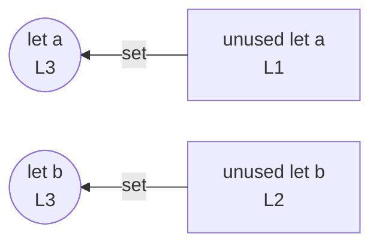

# integration/fixtures/declaration/destructuring-assignment/array/input.ts

## Input

```ts
let a = 1;
let b = 2;
[a, b] = [3, 4];
```

## Mermaid


```mermaid
%%{init: {"flowchart": {"defaultRenderer": "elk"}}}%%
flowchart RL
  n_scope_0_a_4["unused let a<br/>L1"]
  n_scope_0_b_15["unused let b<br/>L2"]
  wr_ref_2(["let a<br/>L3"])
  wr_ref_3(["let b<br/>L3"])
  n_scope_0_a_4 -->|set| wr_ref_2
  n_scope_0_b_15 -->|set| wr_ref_3
```
