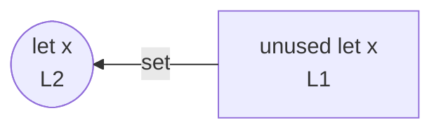

# integration/fixtures/declaration/let/write-only/input.ts

## Input

```ts
let x = 1;
x = 2;
```

## Mermaid


```mermaid
%%{init: {"flowchart": {"defaultRenderer": "elk"}}}%%
flowchart RL
  n_scope_0_x_4["unused let x<br/>L1"]
  wr_ref_1(["let x<br/>L2"])
  n_scope_0_x_4 -->|set| wr_ref_1
```
