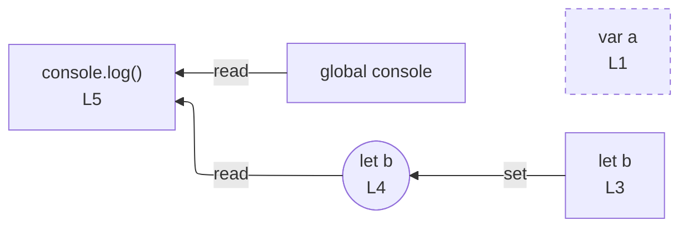

# integration/fixtures/declaration/mixed/var-and-let-reassigned/input.ts

## Notice

```
uns: warning: L1:0: var declaration detected; rendered as node only (no edges).
```

## Input

```ts
var a = 0;
a = 1;
let b = 2;
b = 3;
console.log(a, b);
```

## Mermaid


