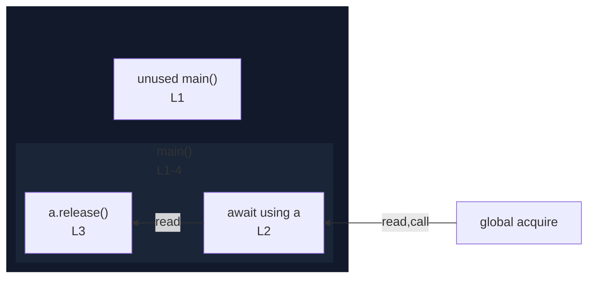

# integration/fixtures/declaration/using/await/input.ts

## Input

```ts
async function main() {
  await using a = acquire();
  a.release();
}
```

## Mermaid


```mermaid
%%{init: {"flowchart": {"defaultRenderer": "elk"}}}%%
flowchart RL
  n_scope_0_acquire_42["global acquire"]
  subgraph wrap_s_scope_1[" "]
    direction TB
    n_scope_0_main_15["unused main()<br/>L1"]
    subgraph s_scope_1["main()<br/>L1-4"]
      direction RL
      n_scope_1_a_38["await using a<br/>L2"]
      expr_stmt_55["a.release()<br/>L3"]
    end
  end
  n_scope_0_acquire_42 -->|read,call| n_scope_1_a_38
  n_scope_1_a_38 -->|read| expr_stmt_55
  classDef nestL1 fill:#11192a,stroke:transparent;
  class wrap_s_scope_1 nestL1;
  classDef nestL2 fill:#1a2538,stroke:transparent;
  class s_scope_1 nestL2;
```
