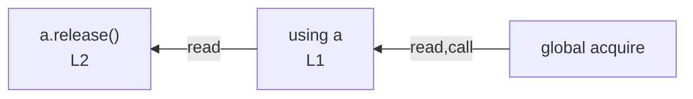

# integration/fixtures/declaration/using/sync/input.ts

## Input

```ts
using a = acquire();
a.release();
```

## Mermaid


```mermaid
%%{init: {"flowchart": {"defaultRenderer": "elk"}}}%%
flowchart RL
  n_scope_0_a_6["using a<br/>L1"]
  n_scope_0_acquire_10["global acquire"]
  n_scope_0_acquire_10 -->|read,call| n_scope_0_a_6
  n_scope_0_a_6 -->|read| expr_stmt_21
  expr_stmt_21["a.release()<br/>L2"]
```
