# integration/fixtures/declaration/var/hoisting-from-block/input.ts

## Notice

```
uns: warning: L3:2: var declaration detected; rendered as node only (no edges).
```

## Input

```ts
const cond = true;
if (cond) {
  var y = 1;
}
console.log(y);
```

## Mermaid

```mermaid
%%{init: {"flowchart": {"defaultRenderer": "elk"}}}%%
flowchart RL
  n_scope_0_cond_6["cond<br/>L1"]
  n_scope_0_y_37["var y<br/>L3"]
  n_scope_0_console_46["global console"]
  subgraph s_scope_1["if L2-4"]
    direction RL
    if_test_scope_0_19{"if ()<br/>L2"}
  end
  n_scope_0_cond_6 -->|read| if_test_scope_0_19
  n_scope_0_console_46 -->|read| expr_stmt_46
  expr_stmt_46["console.log()<br/>L5"]
  classDef varNode stroke-dasharray:5 5;
  class n_scope_0_y_37 varNode;
  classDef nestL1 fill:#1e2738,stroke:#3d4a63;
  class s_scope_1 nestL1;
```


