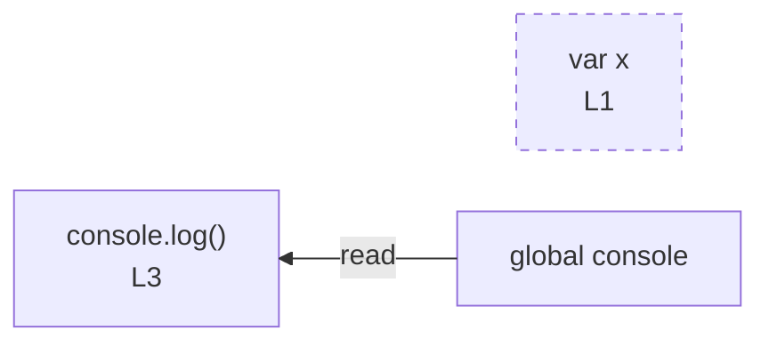

# integration/fixtures/declaration/var/redeclaration/input.ts

## Notice

```
uns: warning: L1:0: var declaration detected; rendered as node only (no edges).
uns: warning: L2:0: var declaration detected; rendered as node only (no edges).
```

## Input

```ts
var x = 1;
var x = 2;
console.log(x);
```

## Mermaid


