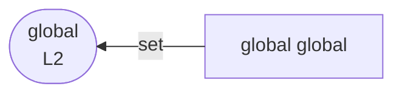

# integration/fixtures/declaration/var/with-implicit-global/input.ts

## Input

```ts
var a = 0;
global = 1;
```

## Mermaid


```mermaid
%%{init: {"flowchart": {"defaultRenderer": "elk"}}}%%
flowchart RL
  n_scope_0_global_11["global global"]
  wr_ref_0(["global<br/>L2"])
  n_scope_0_global_11 -->|set| wr_ref_0
```
