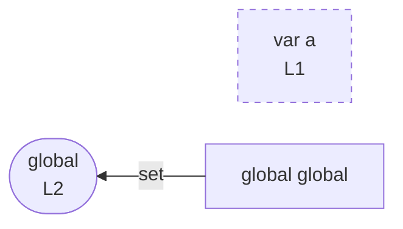

# integration/fixtures/declaration/var/with-implicit-global/input.ts

## Notice

```
uns: warning: L1:0: var declaration detected; rendered as node only (no edges).
```

## Input

```ts
var a = 0;
global = 1;
```

## Mermaid


