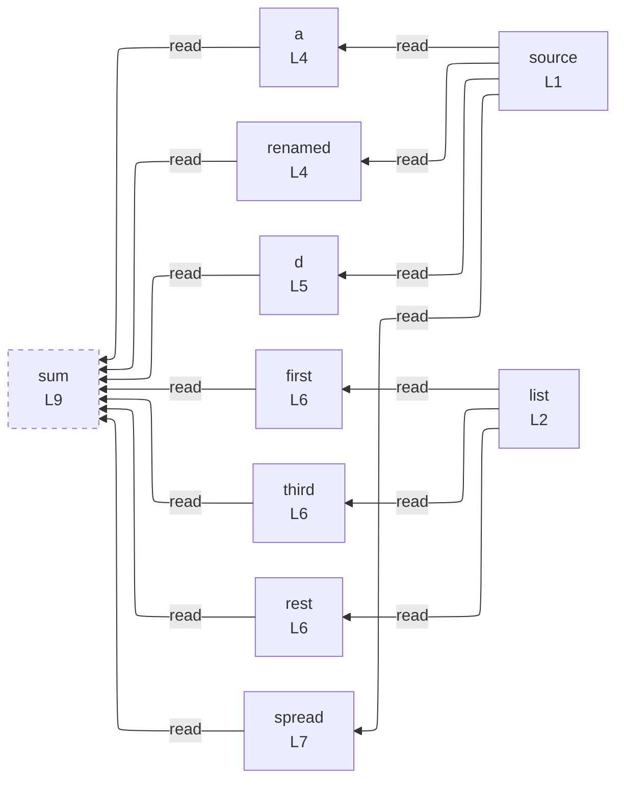

# integration/fixtures/destructuring/input.ts

## Input

```ts
const source = { a: 1, b: 2, c: 3, nested: { d: 4 } };
const list = [10, 20, 30, 40];

const { a, b: renamed } = source;
const { nested: { d } } = source;
const [first, , third, ...rest] = list;
const { ...spread } = source;

const sum = a + renamed + d + first + third + rest.length + Object.keys(spread).length;
```

## Mermaid


