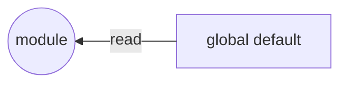

# integration/fixtures/exports/all-with-default-alias/input.ts

## Input

```ts
export * as default from "./base.js";
```

## Mermaid


```mermaid
%%{init: {"flowchart": {"defaultRenderer": "elk"}}}%%
flowchart RL
  n_scope_0_default_12["global default"]
  n_scope_0_default_12 -->|read| module_root
  module_root((module))
```
