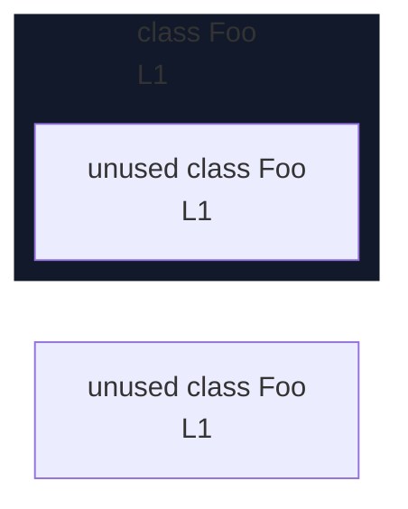

# integration/fixtures/exports/default-class/input.ts

## Input

```ts
export default class Foo {}
```

## Mermaid


```mermaid
%%{init: {"flowchart": {"defaultRenderer": "elk"}}}%%
flowchart RL
  n_scope_0_Foo_21["unused class Foo<br/>L1"]
  subgraph s_scope_1["class Foo<br/>L1"]
    direction RL
    n_scope_1_Foo_21["unused class Foo<br/>L1"]
  end
  classDef nestL1 fill:#11192a,stroke:transparent;
  class s_scope_1 nestL1;
```
