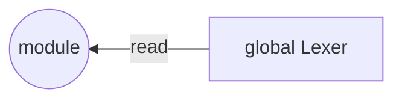

# integration/fixtures/exports/named-with-from/input.ts

## Input

```ts
export { Lexer } from "./Lexer.js";
```

## Mermaid


```mermaid
%%{init: {"flowchart": {"defaultRenderer": "elk"}}}%%
flowchart RL
  n_scope_0_Lexer_9["global Lexer"]
  n_scope_0_Lexer_9 -->|read| module_root
  module_root((module))
```
