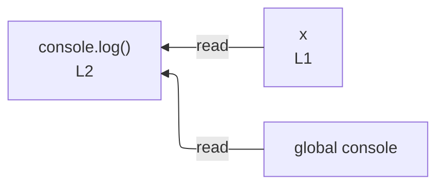

# integration/fixtures/expression-statement-call/input.ts

## Input

```ts
const x = "x";
console.log(x);
```

## Mermaid


```mermaid
%%{init: {"flowchart": {"defaultRenderer": "elk"}}}%%
flowchart RL
  n_scope_0_x_6["x<br/>L1"]
  n_scope_0_console_15["global console"]
  n_scope_0_console_15 -->|read| expr_stmt_15
  n_scope_0_x_6 -->|read| expr_stmt_15
  expr_stmt_15["console.log()<br/>L2"]
```
