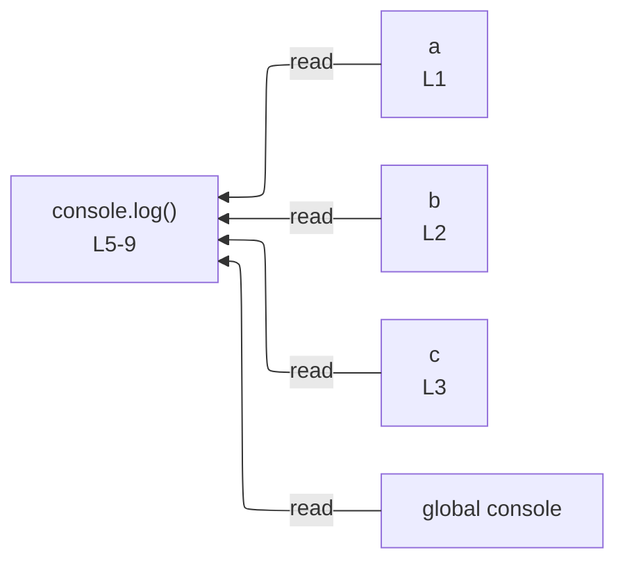

# integration/fixtures/expression-statement-multiline/input.ts

## Input

```ts
const a = 1;
const b = 2;
const c = 3;

console.log(
  a, // first
  b, // second
  c, // third
);
```

## Mermaid


```mermaid
%%{init: {"flowchart": {"defaultRenderer": "elk"}}}%%
flowchart RL
  n_scope_0_a_6["a<br/>L1"]
  n_scope_0_b_19["b<br/>L2"]
  n_scope_0_c_32["c<br/>L3"]
  n_scope_0_console_40["global console"]
  n_scope_0_console_40 -->|read| expr_stmt_40
  n_scope_0_a_6 -->|read| expr_stmt_40
  n_scope_0_b_19 -->|read| expr_stmt_40
  n_scope_0_c_32 -->|read| expr_stmt_40
  expr_stmt_40["console.log()<br/>L5-9"]
```
