# integration/fixtures/expression-statement/awaited-then-catch/input.ts

## Input

```ts
export async function run(): Promise<void> {
  await Promise.resolve()
    .then((value) => {
      console.log("then handler", value);
      console.log("then handler second line");
    })
    .catch((error) => {
      console.error("catch handler", error);
      console.error("catch handler second line");
    });
}
```

## Mermaid

```mermaid
%%{init: {"flowchart": {"defaultRenderer": "elk"}}}%%
flowchart RL
  n_scope_0_Promise_53["global Promise"]
  n_scope_0_console_100["global console"]
  subgraph wrap_s_scope_1[" "]
    direction TB
    n_scope_0_run_22["unused run()<br/>L1"]
    subgraph s_scope_1["run()<br/>L1-11"]
      direction RL
      expr_stmt_47["await Promise.resolve().then().catch()<br/>L2-10"]
      subgraph s_scope_2["(anonymous)<br/>L3-6"]
        direction RL
        n_scope_2_value_82["value<br/>L3"]
        expr_stmt_100["console.log()<br/>L4"]
        expr_stmt_142["console.log()<br/>L5"]
      end
      subgraph s_scope_3["(anonymous)<br/>L7-10"]
        direction RL
        n_scope_3_error_202["error<br/>L7"]
        expr_stmt_220["console.error()<br/>L8"]
        expr_stmt_265["console.error()<br/>L9"]
      end
    end
  end
  n_scope_0_Promise_53 -->|read| expr_stmt_47
  n_scope_0_console_100 -->|read| expr_stmt_100
  n_scope_2_value_82 -->|read| expr_stmt_100
  n_scope_0_console_100 -->|read| expr_stmt_142
  n_scope_0_console_100 -->|read| expr_stmt_220
  n_scope_3_error_202 -->|read| expr_stmt_220
  n_scope_0_console_100 -->|read| expr_stmt_265
  classDef fnWrap fill:#1a2030,stroke:#5a7d99;
  class wrap_s_scope_1 fnWrap;
```


