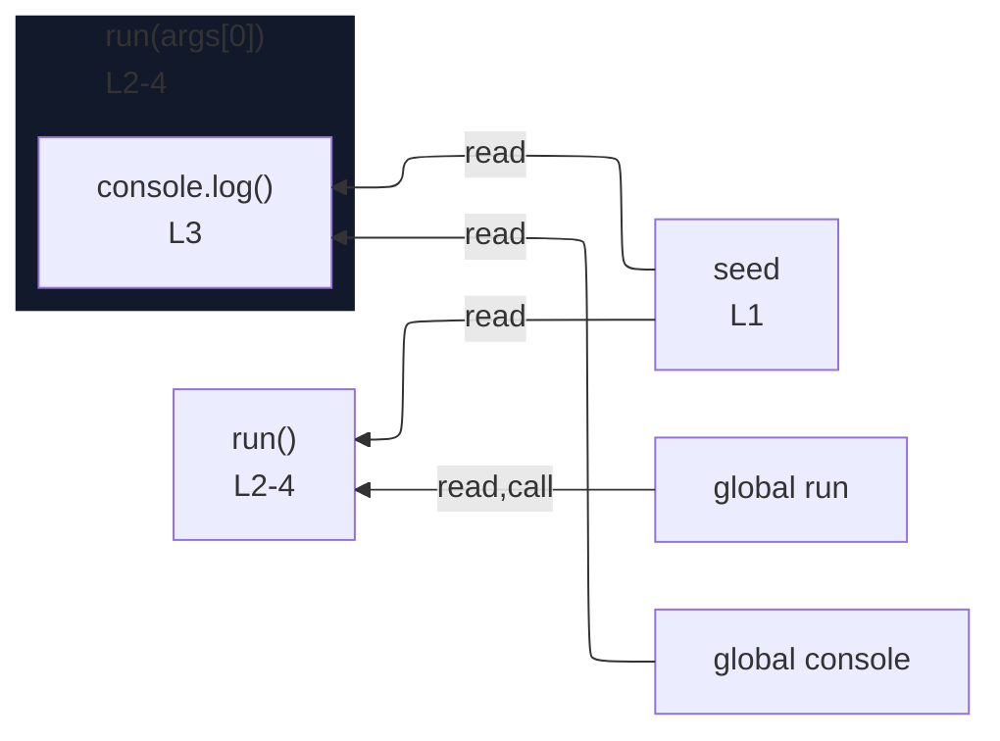

# integration/fixtures/expression-statement/call-with-callback-and-array/input.ts

## Input

```ts
const seed = 42;
run(() => {
  console.log(seed);
}, [seed]);
```

## Mermaid


```mermaid
%%{init: {"flowchart": {"defaultRenderer": "elk"}}}%%
flowchart RL
  n_scope_0_seed_6["seed<br/>L1"]
  n_scope_0_run_17["global run"]
  n_scope_0_console_31["global console"]
  subgraph s_scope_1["run(args[0])<br/>L2-4"]
    direction RL
    expr_stmt_31["console.log()<br/>L3"]
  end
  n_scope_0_run_17 -->|read,call| expr_stmt_17
  n_scope_0_console_31 -->|read| expr_stmt_31
  n_scope_0_seed_6 -->|read| expr_stmt_31
  n_scope_0_seed_6 -->|read| expr_stmt_17
  expr_stmt_17["run()<br/>L2-4"]
  classDef nestL1 fill:#11192a,stroke:transparent;
  class s_scope_1 nestL1;
```
