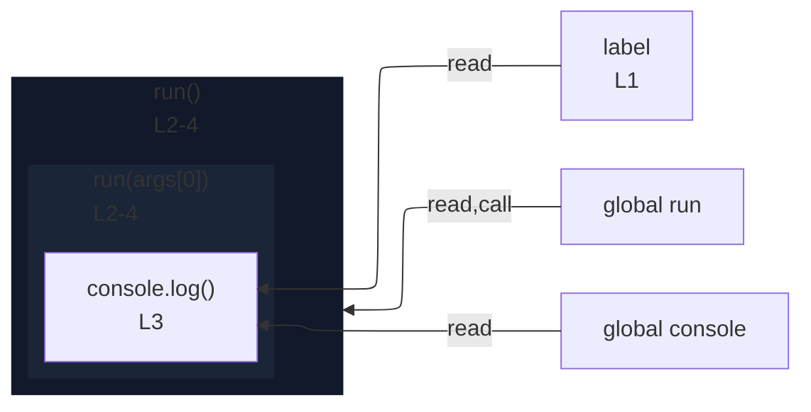

# integration/fixtures/expression-statement/call-with-callback/input.ts

## Input

```ts
const label = "outer";
run(() => {
  console.log(label);
});
```

## Mermaid


```mermaid
%%{init: {"flowchart": {"defaultRenderer": "elk"}}}%%
flowchart RL
  n_scope_0_label_6["label<br/>L1"]
  n_scope_0_run_23["global run"]
  n_scope_0_console_37["global console"]
  subgraph expr_stmt_23["run()<br/>L2-4"]
    direction RL
    subgraph s_scope_1["run(args[0])<br/>L2-4"]
      direction RL
      expr_stmt_37["console.log()<br/>L3"]
    end
  end
  n_scope_0_run_23 -->|read,call| expr_stmt_23
  n_scope_0_console_37 -->|read| expr_stmt_37
  n_scope_0_label_6 -->|read| expr_stmt_37
  classDef nestL1 fill:#11192a,stroke:transparent;
  class expr_stmt_23 nestL1;
  classDef nestL2 fill:#1a2538,stroke:transparent;
  class s_scope_1 nestL2;
```
