# integration/fixtures/expression-statement/call-with-conditional-argument/input.ts

## Input

```ts
const flag = true;
const left = "on";
const right = "off";

console.log(flag ? left : right);
```

## Mermaid

```mermaid
%%{init: {"flowchart": {"defaultRenderer": "elk"}}}%%
flowchart RL
  n_scope_0_flag_6["flag<br/>L1"]
  n_scope_0_left_25["left<br/>L2"]
  n_scope_0_right_44["right<br/>L3"]
  n_scope_0_console_60["global console"]
  subgraph cont_ternary_scope_0_72["ternary ?: L5"]
    direction RL
    subgraph s_scope_1["? then L5"]
      direction RL
      ternary_test_scope_0_72{"ternary ?:<br/>L5"}
    end
    subgraph s_scope_2[": else L5"]
      direction RL
      elk_empty_s_scope_2["No nodes"]
    end
  end
  n_scope_0_console_60 -->|read| expr_stmt_60
  n_scope_0_flag_6 -->|read| ternary_test_scope_0_72
  n_scope_0_left_25 -->|read| expr_stmt_60
  n_scope_0_right_44 -->|read| expr_stmt_60
  expr_stmt_60["console.log()<br/>L5"]
  classDef nestL1 fill:#11192a,stroke:transparent;
  class cont_ternary_scope_0_72 nestL1;
  classDef nestL2 fill:#1a2538,stroke:transparent;
  class s_scope_1 nestL2;
  class s_scope_2 nestL2;
  classDef elkEmptyPlaceholder fill:transparent,stroke:transparent;
  class elk_empty_s_scope_2 elkEmptyPlaceholder;
```


