# integration/fixtures/expression-statement/call-with-three-callbacks/input.ts

## Input

```ts
const a = 1;
const b = 2;
const c = 3;
run(
  () => {
    console.log(a);
  },
  () => {
    console.log(b);
  },
  () => {
    console.log(c);
  },
);
```

## Mermaid

```mermaid
%%{init: {"flowchart": {"defaultRenderer": "elk"}}}%%
flowchart RL
  n_scope_0_a_6["a<br/>L1"]
  n_scope_0_b_19["b<br/>L2"]
  n_scope_0_c_32["c<br/>L3"]
  n_scope_0_run_39["global run"]
  n_scope_0_console_58["global console"]
  subgraph expr_stmt_39["run()<br/>L4-14"]
    direction RL
    subgraph s_scope_1["run(args[0])<br/>L5-7"]
      direction RL
      expr_stmt_58["console.log()<br/>L6"]
    end
    subgraph s_scope_2["run(args[1])<br/>L8-10"]
      direction RL
      expr_stmt_93["console.log()<br/>L9"]
    end
    subgraph s_scope_3["run(args[2])<br/>L11-13"]
      direction RL
      expr_stmt_128["console.log()<br/>L12"]
    end
  end
  n_scope_0_run_39 -->|read,call| expr_stmt_39
  n_scope_0_console_58 -->|read| expr_stmt_58
  n_scope_0_a_6 -->|read| expr_stmt_58
  n_scope_0_console_58 -->|read| expr_stmt_93
  n_scope_0_b_19 -->|read| expr_stmt_93
  n_scope_0_console_58 -->|read| expr_stmt_128
  n_scope_0_c_32 -->|read| expr_stmt_128
  classDef nestL1 fill:#11192a,stroke:transparent;
  class expr_stmt_39 nestL1;
  classDef nestL2 fill:#1a2538,stroke:transparent;
  class s_scope_1 nestL2;
  class s_scope_2 nestL2;
  class s_scope_3 nestL2;
```


