# integration/fixtures/expression-statement/conditional-callback-reassignment/input.ts

## Input

```ts
let result = [0];
const items = [1, 2, 3];
const fallback = [9];
const enabled = true;

result = enabled ? items.map((v) => v * 2) : fallback;
```

## Mermaid

```mermaid
%%{init: {"flowchart": {"defaultRenderer": "elk"}}}%%
flowchart RL
  n_scope_0_result_4["unused let result<br/>L1"]
  n_scope_0_items_24["items<br/>L2"]
  n_scope_0_fallback_49["fallback<br/>L3"]
  n_scope_0_enabled_71["enabled<br/>L4"]
  wr_ref_4(["let result<br/>L6"])
  subgraph cont_ternary_scope_0_97["ternary ?: L6"]
    direction RL
    subgraph s_scope_1["? then L6"]
      direction RL
      ternary_test_scope_0_97{"ternary ?:<br/>L6"}
      subgraph call_proxy_97["items.map()<br/>L6"]
        direction RL
        subgraph s_scope_2["items.map(args[0])<br/>L6"]
          direction RL
          n_scope_2_v_118["v<br/>L6"]
          subgraph s_return_scope_2_124_129["return L6"]
            direction RL
            ret_use_ref_7["v<br/>L6"]
          end
        end
      end
    end
    subgraph s_scope_3[": else L6"]
      direction RL
      elk_empty_s_scope_3["No nodes"]
    end
  end
  call_proxy_97 -->|read| wr_ref_4
  n_scope_0_result_4 -->|set| wr_ref_4
  n_scope_0_enabled_71 -->|read| ternary_test_scope_0_97
  n_scope_0_items_24 -->|read| call_proxy_97
  n_scope_2_v_118 -->|read| ret_use_ref_7
  n_scope_0_fallback_49 -->|read| wr_ref_4
  classDef nestL1 fill:#11192a,stroke:transparent;
  class cont_ternary_scope_0_97 nestL1;
  classDef nestL2 fill:#1a2538,stroke:transparent;
  class s_scope_1 nestL2;
  class s_scope_3 nestL2;
  classDef nestL3 fill:#243047,stroke:transparent;
  class call_proxy_97 nestL3;
  classDef nestL4 fill:#2d3b57,stroke:transparent;
  class s_scope_2 nestL4;
  classDef nestL5 fill:#364666,stroke:transparent;
  class s_return_scope_2_124_129 nestL5;
  classDef edgeTargetSubgraph stroke:#888;
  class call_proxy_97 edgeTargetSubgraph;
  classDef elkEmptyPlaceholder fill:transparent,stroke:transparent;
  class elk_empty_s_scope_3 elkEmptyPlaceholder;
```


