# integration/fixtures/expression-statement/conditional-parenthesized/input.ts

## Input

```ts
const enabled = true;

(enabled
  ? "the value selected when the condition is true, kept long on purpose"
  : "the value selected when the condition is false, also kept long");
```

## Mermaid

```mermaid
%%{init: {"flowchart": {"defaultRenderer": "elk"}}}%%
flowchart RL
  n_scope_0_enabled_6["enabled<br/>L1"]
  subgraph cont_ternary_scope_0_24["ternary ?: L3-5"]
    direction RL
    subgraph s_scope_1["? then L4"]
      direction RL
      ternary_test_scope_0_24{"ternary ?:<br/>L3"}
    end
    subgraph s_scope_2[": else L5"]
      direction RL
      elk_empty_s_scope_2["No nodes"]
    end
  end
  n_scope_0_enabled_6 -->|read| ternary_test_scope_0_24
  classDef nestL1 fill:#11192a,stroke:transparent;
  class cont_ternary_scope_0_24 nestL1;
  classDef nestL2 fill:#1a2538,stroke:transparent;
  class s_scope_1 nestL2;
  class s_scope_2 nestL2;
  classDef elkEmptyPlaceholder fill:transparent,stroke:transparent;
  class elk_empty_s_scope_2 elkEmptyPlaceholder;
```


