# integration/fixtures/expression-statement/conditional-with-callback/input.ts

## Input

```ts
const items = [1, 2, 3];
const enabled = true;

enabled ? items.map((v) => v * 2) : items;
```

## Mermaid

```mermaid
%%{init: {"flowchart": {"defaultRenderer": "elk"}}}%%
flowchart RL
  n_scope_0_items_6["items<br/>L1"]
  n_scope_0_enabled_31["enabled<br/>L2"]
  subgraph cont_ternary_scope_0_48["ternary ?: L4"]
    direction RL
    subgraph s_scope_1["? then L4"]
      direction RL
      ternary_test_scope_0_48{"ternary ?:<br/>L4"}
      subgraph s_scope_2["items.map(args[0])<br/>L4"]
        direction RL
        n_scope_2_v_69["v<br/>L4"]
        subgraph s_return_scope_2_75_80["return L4"]
          direction RL
          ret_use_ref_4["v<br/>L4"]
        end
      end
    end
    subgraph s_scope_3[": else L4"]
      direction RL
      elk_empty_s_scope_3["No nodes"]
    end
  end
  n_scope_0_enabled_31 -->|read| ternary_test_scope_0_48
  n_scope_0_items_6 -->|read| module_root
  n_scope_2_v_69 -->|read| ret_use_ref_4
  module_root((module))
  classDef nestL1 fill:#11192a,stroke:transparent;
  class cont_ternary_scope_0_48 nestL1;
  classDef nestL2 fill:#1a2538,stroke:transparent;
  class s_scope_1 nestL2;
  class s_scope_3 nestL2;
  classDef nestL3 fill:#243047,stroke:transparent;
  class s_scope_2 nestL3;
  classDef nestL4 fill:#2d3b57,stroke:transparent;
  class s_return_scope_2_75_80 nestL4;
  classDef elkEmptyPlaceholder fill:transparent,stroke:transparent;
  class elk_empty_s_scope_3 elkEmptyPlaceholder;
```


