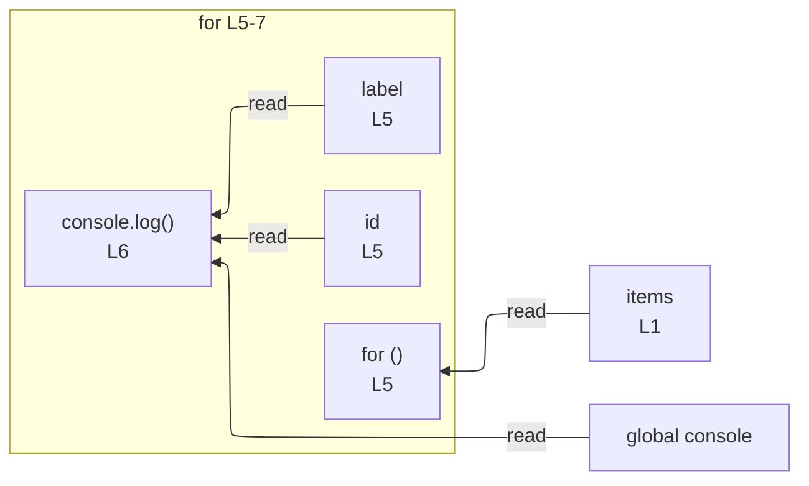

# integration/fixtures/for-statement/for-of/object-destructuring/input.ts

## Input

```ts
const items = [
  { id: 1, label: "x" },
  { id: 2, label: "y" },
];
for (const { id, label } of items) {
  console.log(id, label);
}
```

## Mermaid


