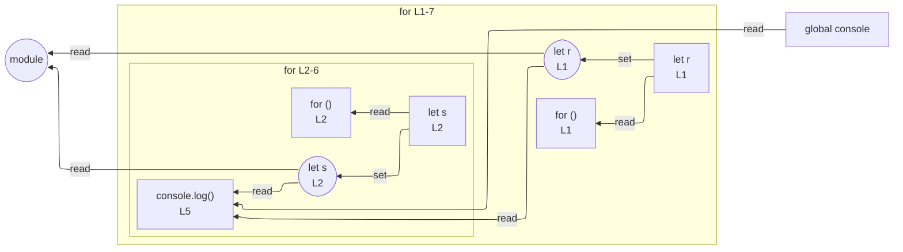

# integration/fixtures/for/classic-for/labeled-break-continue/input.ts

## Input

```ts
outer_loop: for (let r = 0; r < 3; r++) {
  for (let s = 0; s < 3; s++) {
    if (s === 1) continue outer_loop;
    if (r === 2) break outer_loop;
    console.log(r, s);
  }
}
```

## Mermaid


