# integration/fixtures/for/for-await-of/async-iterator/input.ts

## Input

```ts
async function asyncLoop() {
  async function* gen() {
    yield 1;
    yield 2;
  }
  for await (const v of gen()) {
    console.log(v);
  }
}
```

## Mermaid

```mermaid
%%{init: {"flowchart": {"defaultRenderer": "elk"}}}%%
flowchart RL
  n_scope_0_console_122["global console"]
  subgraph wrap_s_scope_1[" "]
    direction TB
    n_scope_0_asyncLoop_15["unused asyncLoop()<br/>L1"]
    subgraph s_scope_1["asyncLoop()<br/>L1-9"]
      direction RL
      subgraph wrap_s_scope_2[" "]
        direction TB
        n_scope_1_gen_47["gen()<br/>L2"]
        subgraph s_scope_2["gen()<br/>L2-5"]
          direction RL
        end
      end
      subgraph s_scope_3["for L6-8"]
        direction RL
        for_test_scope_1_87["for ()<br/>L6"]
        n_scope_3_v_104["v<br/>L6"]
        expr_stmt_122["console.log()<br/>L7"]
      end
    end
  end
  n_scope_1_gen_47 -->|read,call| for_test_scope_1_87
  n_scope_0_console_122 -->|read| expr_stmt_122
  n_scope_3_v_104 -->|read| expr_stmt_122
  classDef fnWrap fill:#1a2030,stroke:#5a7d99;
  class wrap_s_scope_1 fnWrap;
  class wrap_s_scope_2 fnWrap;
```


