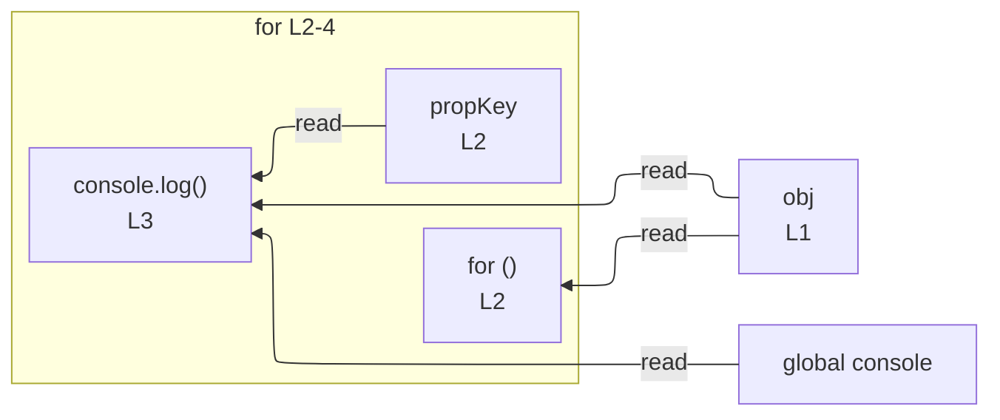

# integration/fixtures/for/for-in/basic/input.ts

## Input

```ts
const obj = { a: 1, b: 2 };
for (const propKey in obj) {
  console.log(propKey, obj[propKey]);
}
```

## Mermaid


```mermaid
%%{init: {"flowchart": {"defaultRenderer": "elk"}}}%%
flowchart RL
  n_scope_0_obj_6["obj<br/>L1"]
  n_scope_0_console_59["global console"]
  subgraph s_scope_1["for L2-4"]
    direction RL
    for_test_scope_0_28["for ()<br/>L2"]
    n_scope_1_propKey_39["propKey<br/>L2"]
    expr_stmt_59["console.log()<br/>L3"]
  end
  n_scope_0_obj_6 -->|read| for_test_scope_0_28
  n_scope_0_console_59 -->|read| expr_stmt_59
  n_scope_1_propKey_39 -->|read| expr_stmt_59
  n_scope_0_obj_6 -->|read| expr_stmt_59
```
