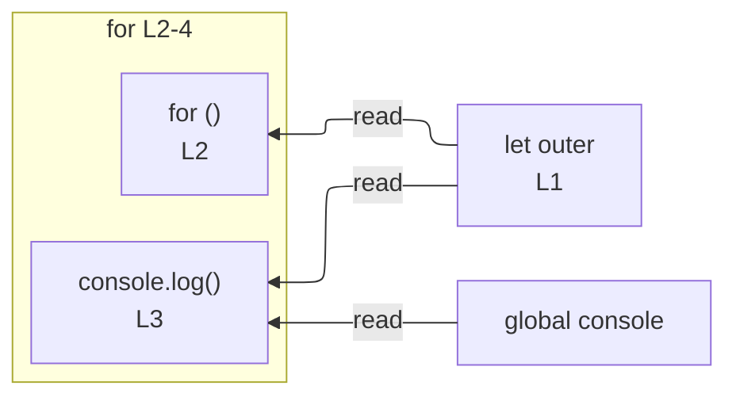

# integration/fixtures/for/for-of/assignment-no-declaration/input.ts

## Input

```ts
let outer: number;
for (outer of [1, 2, 3]) {
  console.log(outer);
}
```

## Mermaid


```mermaid
%%{init: {"flowchart": {"defaultRenderer": "elk"}}}%%
flowchart RL
  n_scope_0_outer_4["let outer<br/>L1"]
  n_scope_0_console_48["global console"]
  subgraph s_scope_1["for L2-4"]
    direction RL
    for_test_scope_0_19["for ()<br/>L2"]
    expr_stmt_48["console.log()<br/>L3"]
  end
  n_scope_0_outer_4 -->|read| for_test_scope_0_19
  n_scope_0_console_48 -->|read| expr_stmt_48
  n_scope_0_outer_4 -->|read| expr_stmt_48
```
