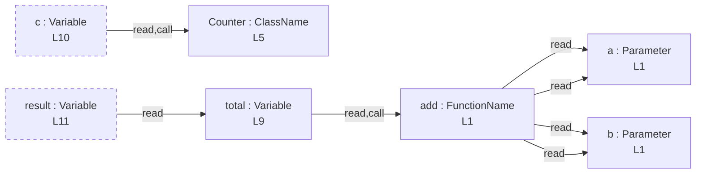

# function-and-class

## Input (`input.ts`)

```ts
function add(a: number, b: number) {
  return a + b;
}

class Counter {
  start = 0;
}

const total = add(1, 2);
const c = new Counter();
const result = total;
```

## Mermaid


